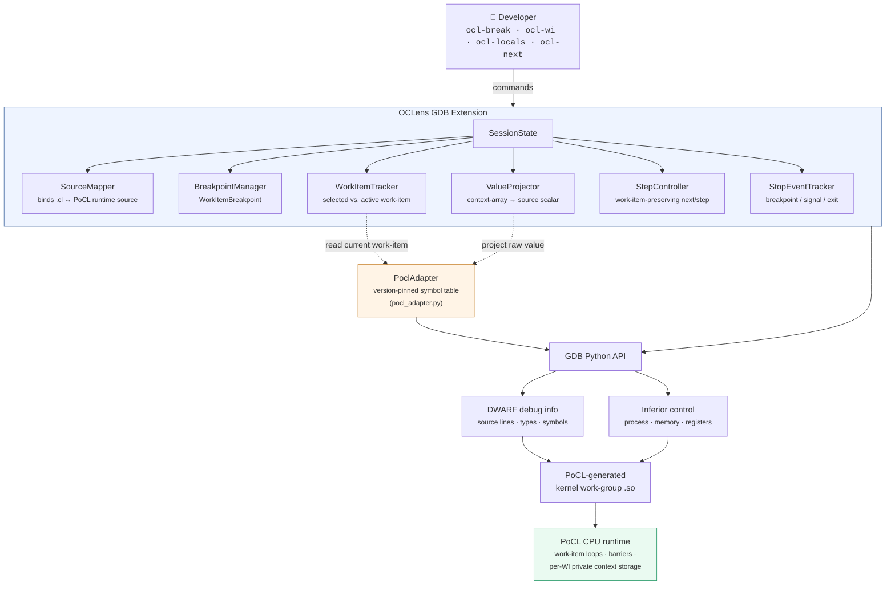
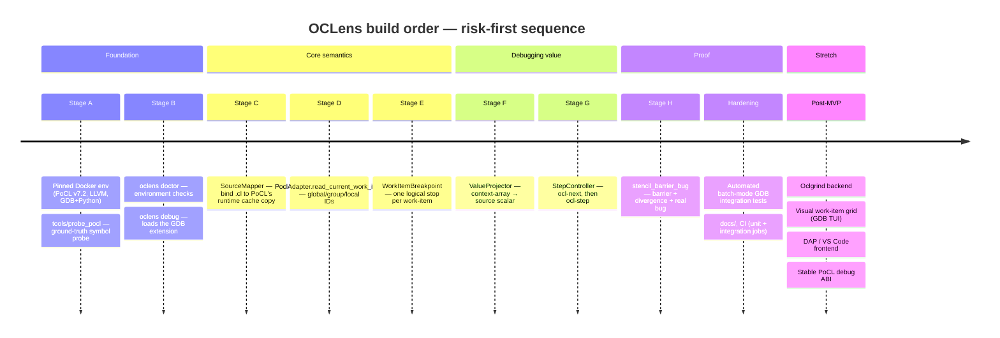

# OCLens

> Work-item-aware source debugging for OpenCL kernels.

OCLens is a source-level debugger prototype for OpenCL C kernels running on the
[Portable Computing Language (PoCL)](https://portablecl.org/) CPU backend.

GDB can already attach to a PoCL kernel and single-step native code — PoCL's own
documentation shows that much. What GDB *doesn't* understand is the user's mental
model: work-items, work-groups, global/local IDs, barriers, and divergent control
flow. OCLens is the missing semantic layer between "a native debugger on some
compiler-generated code" and "a debugger that understands OpenCL."

```text
(oclens) ocl-wi global 5
(oclens) ocl-run
...
Work-item:
  global = (5,0,0)
  group  = (0,0,0)
  local  = (5,0,0)
23  result = private_value - left;   // BUG

(oclens) ocl-locals
gid           = 5
lid           = 5
private_value = 12
left          = 10
result        = 22
```

That's the core trick: turning `break kernel.cl:23`, which fires for every
work-item, into `break kernel.cl:23 for OpenCL global work-item 5`.

## Table of contents

- [Why OCLens exists](#why-oclens-exists)
- [What it does](#what-it-does)
- [Architecture](#architecture)
- [Quick start](#quick-start)
- [Demo walkthrough](#demo-walkthrough)
- [Commands](#commands)
- [Repository layout](#repository-layout)
- [Development timeline](#development-timeline)
- [Testing](#testing)
- [Scope and non-goals](#scope-and-non-goals)
- [Known limitations](#known-limitations)
- [Roadmap](#roadmap)
- [Research basis](#research-basis)
- [License](#license)

## Why OCLens exists

OpenCL's programming model is expressed in work-items, work-groups, global/local
IDs, private and local memory, and barriers. PoCL's CPU backend lowers all of that
into something much less intuitive:

```text
OpenCL source
  │
  ▼
Clang / LLVM IR + debug metadata
  │
  ▼
PoCL work-group transformation
  ├── software loops over work-items
  ├── compiler-generated work-item ID state
  ├── per-work-item context storage
  └── barrier-region transformations
  │
  ▼
native CPU work-group function (.so)
  │
  ▼
GDB
```

A private OpenCL variable can show up in GDB as something like
`{{{12, 14, 16, 18, 20, 22, 24, 26}}}` instead of `private_value = 22`. That first
representation is PoCL's transformed work-group implementation; the second is what
a developer debugging work-item `global=(5,0,0)` actually wants. OCLens sits
between the two views and does the translation.

**The project's contribution is *not* "launch GDB on PoCL."** It's the OpenCL-aware
adapter that:

1. discovers the PoCL-generated kernel object at runtime;
2. binds the user's original `.cl` file to PoCL's cached runtime source;
3. reconstructs the currently executing OpenCL work-item;
4. filters breakpoints by work-item identity;
5. converts PoCL's transformed variable representation back into the selected
   work-item's source-level value; and
6. keeps stepping conceptually attached to one work-item instead of exposing
   PoCL's compiler-generated work-item loops.

OCLens deliberately does **not** debug real GPU silicon, and it deliberately does
**not** reimplement [Oclgrind](https://github.com/jrprice/Oclgrind)'s simulator-based
debugger. It answers a narrower question instead: *can an ordinary native debugger,
plus LLVM debug info and a semantic adapter, be given enough OpenCL execution
semantics to feel like a GPU-oriented source debugger?*

## What it does

- source-line breakpoints in `.cl` files;
- breakpoints filtered to a particular OpenCL work-item;
- global, group, and local work-item identity at every stop;
- source-level local-variable inspection through LLVM/DWARF debug information;
- automatic projection of PoCL's per-work-item private-variable storage;
- work-item-preserving source stepping;
- inspection of kernel arguments and memory;
- deterministic execution suitable for debugging multi-work-item kernels.

Everything is built on `PoCL CPU backend → LLVM/DWARF → GDB → OCLens semantic
adapter`. DWARF parsing, `ptrace`, and process control stay GDB's job; OCLens owns
the OpenCL semantics on top.

## Architecture



All assumptions about PoCL internals (symbol names, context-array layout, work-item
lowering) are isolated behind a single `PoclAdapter`, so future PoCL versions or
alternate backends (e.g. Oclgrind) can be added without touching the rest of the
codebase. GDB stays fully responsible for DWARF parsing and process control
(`ptrace`); OCLens never duplicates either.

## Quick start

### Native Linux

```bash
# System + PoCL prerequisites (pinned to v7.2)
./scripts/bootstrap_ubuntu.sh
./scripts/build_pocl.sh

# Python environment
python3 -m venv .venv
source .venv/bin/activate
python -m pip install --upgrade pip
python -m pip install -e .

# Sanity check
oclens doctor

# Build the example kernels/hosts
cmake -S . -B build -G Ninja
cmake --build build

# Confirm the demo kernel is actually buggy
./build/examples/stencil_barrier_bug
# Mismatch at gid=5: expected=22 actual=2
# Kernel result: FAIL (intentional demo bug)
```

### Docker

The Docker image pins the compiler/debugger toolchain so the demo doesn't depend
on the host machine's PoCL version.

```bash
docker build -t oclens-dev .

docker run --rm -it \
  --cap-add=SYS_PTRACE \
  --security-opt seccomp=unconfined \
  -v "$PWD":/workspace \
  oclens-dev
```

Inside the container:

```bash
cd /workspace
python3 -m venv .venv && source .venv/bin/activate
pip install -e .
cmake -S . -B build -G Ninja
cmake --build build
oclens doctor
pytest -q
```

### `oclens doctor`

```text
OCLens environment check
[ok] Linux
[ok] Python
[ok] GDB found
[ok] GDB Python API available
[ok] OpenCL loader found
[ok] PoCL platform found
[ok] PoCL target version recognised
[ok] CPU device found

PoCL debugger configuration:
  extra build flags             : -g -cl-opt-disable
  leave kernel compiler temp files: 1
  work group method             : loops
  wiloops max unroll count      : 0
  cpu max cu count              : 1
  kernel cache                  : 1
  cache dir                     : ~/.cache/oclens/pocl
```

## Demo walkthrough

Launch OCLens against the intentionally buggy `stencil_barrier_bug` kernel:

```bash
oclens debug \
  --exe ./build/examples/stencil_barrier_bug \
  --kernel stencil_barrier_bug \
  --source ./examples/stencil_barrier_bug/stencil_barrier_bug.cl \
  --local-size 8,1,1
```

```text
(oclens) ocl-break 23
Breakpoint 1: stencil_barrier_bug.cl:23

(oclens) ocl-wi global 5
Selected work-item: global=(5,0,0)

(oclens) ocl-run
OCLens: kernel object loaded
OCLens: source mapped
  original: examples/stencil_barrier_bug/stencil_barrier_bug.cl
  runtime : .../pocl-cache/.../tempfile-....cl

Stopped at stencil_barrier_bug.cl:23
Reason: breakpoint
Work-item:
  global = (5,0,0)
  group  = (0,0,0)
  local  = (5,0,0)
23  result = private_value - left;  // BUG

(oclens) ocl-locals
gid           = 5
lid           = 5
private_value = 12
left          = 10
result        = 22

(oclens) ocl-next
Stopped at stencil_barrier_bug.cl:26
Work-item:
  global = (5,0,0)
  group  = (0,0,0)
  local  = (5,0,0)
26  out[gid] = result;

(oclens) ocl-print result
2

(oclens) ocl-continue
```

`work-item 5` stays the debugging context throughout: the same source line runs
for every other work-item without ever stopping the session.

The demo kernel deliberately combines multiple work-items, two work-groups,
private per-work-item state, local memory, a legal barrier, divergent control
flow, and a real logic bug (`-` instead of `+`), and the host program
independently verifies the kernel's output so the "bug" is a genuine, provable
mismatch rather than a scripted one.

## Commands

| Command | Purpose |
|---|---|
| `ocl-help` | list available commands |
| `ocl-info` | show session / kernel / work-item state |
| `ocl-break <line>` / `ocl-break <file>:<line>` | set a logical source breakpoint |
| `ocl-breaks` | list logical breakpoints |
| `ocl-wi global <x>[,y,z]` | select a work-item by global ID |
| `ocl-wi local <x>[,y,z] group <x>[,y,z]` | select a work-item by local ID + group |
| `ocl-wi show` / `ocl-wi clear` | show or clear the current selection |
| `ocl-run` | load the kernel, bind sources, start execution |
| `ocl-continue` | continue to the next matching stop |
| `ocl-next` / `ocl-step` | source step, preserving the active work-item |
| `ocl-locals` | print source-level locals, projected for the active work-item |
| `ocl-print <identifier>` | print one variable's projected value |
| `ocl-eval <gdb-expression>` | delegate an expression straight to GDB |

Nice-to-have (not required for the MVP): `ocl-x`, `ocl-source`, `ocl-restart`,
`ocl-at-global`. Ordinary GDB commands (`bt`, `info locals`, `disassemble`, …)
remain available — OCLens extends GDB, it doesn't replace it.

### Selected vs. active work-item

These are two distinct concepts that OCLens keeps separate everywhere:

- **selected work-item** — the work-item execution should stop on next.
- **active work-item** — the work-item corresponding to the machine state at the
  *current* stop.

They're normally identical right after an OCLens breakpoint. If you change the
selection while already stopped:

```text
(oclens) ocl-wi global 6
Selected future work-item: global=(6,0,0)
Current machine state still belongs to:
  global=(5,0,0)
Continue or restart to reach a source stop for the new selection.
```

PoCL's work-item loops serialize work-items as software constructs, so another
work-item's private state isn't simultaneously available at the currently halted
instruction — OCLens is explicit about that rather than pretending otherwise.

## Repository layout

```text
oclens/
├── src/oclens/            # launcher, CLI, doctor, PoCL environment setup
├── gdb/oclens_gdb/         # GDB extension: session, commands, breakpoints,
│                           # value projection, stepping, PoCL adapter
├── examples/               # minimal / vector_add_bug / stencil_barrier_bug
├── tests/
│   ├── unit/                # pure logic, no GDB required
│   ├── integration/         # real GDB + real PoCL, batch-mode .gdb scripts
│   └── fixtures/
├── tools/probe_pocl.*      # runtime probe of PoCL's generated symbols
├── scripts/                 # bootstrap, PoCL build, example build, demo runner
└── docs/
    ├── architecture.md
    ├── pocl-internals.md
    ├── probe-pocl-7.2.md    # ground-truth results from tools/probe_pocl
    └── demo-script.md
```

Detailed build-order notes for contributors (the risk-first implementation
sequence, PoCL probing methodology, and stage-by-stage acceptance criteria) live
in `docs/architecture.md` rather than here.

## Development timeline

OCLens is built in a **risk-first** order: the parts most likely to fail (getting
GDB to genuinely stop inside a PoCL kernel and read its state) come before any
polish. Each stage gates the next — don't start Stage *N+1* until Stage *N*'s
acceptance criteria pass for real, against real PoCL/GDB, not mocks.



| Stage | Focus | Gate to move on |
|---|---|---|
| A — Environment & probe | Reproducible Docker/PoCL/GDB env; record real observations in `docs/probe-pocl-7.2.md` | GDB genuinely stops inside a real PoCL kernel |
| B — Launcher & doctor | `oclens doctor`, `oclens debug` loads the extension | Extension loads cleanly against the pinned env |
| C — Source binding | `SourceMapper` maps original `.cl` ↔ PoCL's cached runtime source | `ocl-break <line>` stops at the right line, unfiltered |
| D — Work-item semantics | `PoclAdapter.read_current_work_item`; coordinate math unit-tested | global/group/local IDs are correct at every stop |
| E — Filtered breakpoints | `WorkItemBreakpoint.stop()` | One logical stop for the selected work-item, not N stops |
| F — Source variables | `ocl-locals` / `ocl-print`; context-array projection | Raw PoCL aggregate correctly projects to a source scalar |
| G — Stepping | `StopEventTracker`, `ocl-next`, then `ocl-step` | Active work-item is unchanged before/after a step |
| H — Final demo | `stencil_barrier_bug`: barrier + divergence + real bug | Host reference output proves the bug; full workflow runs end-to-end |
| Hardening | Automated integration tests, docs, CI | `pytest -q` + batch-mode GDB tests pass in a clean clone |
| Stretch | Oclgrind backend, WI grid, DAP, stable PoCL ABI | Only starts after the MVP's integration tests pass |

## Testing

```bash
make test            # everything
make test-unit        # pure logic, mocked, fast
make test-integration  # real GDB + real PoCL, slower
```

Unit tests cover coordinate math, selection comparison, source fingerprinting, and
array-shape logic — pure logic with no GDB dependency. Integration tests run real
batch-mode GDB sessions against the real PoCL-compiled example kernels and assert
on stable machine-readable markers such as:

```text
OCLENS_TEST:BREAKPOINT:PASS
OCLENS_TEST:WORK_ITEM:global=5,0,0
OCLENS_TEST:VARIABLE:private_value=12
OCLENS_TEST:STEP:from=23,to=26
```

The project's central claims — that a breakpoint really stops on one work-item,
that a private array is really projected back to a scalar, that stepping really
preserves the active work-item — are never mocked.

## Scope and non-goals

**v0.1 target:** Linux · PoCL v7.2 · CPU device · OpenCL C · GDB with Python
support · fixed local size · `loops` work-group method with unrolling disabled.

Explicitly out of scope for the MVP: a DWARF parser, direct `ptrace` use, an
OpenCL compiler or IR interpreter, real GPU hardware, warp/wavefront scheduling,
reverse execution, a GUI or VS Code extension, race detection, arbitrary
optimisation-level debugging, arbitrary post-stop work-item switching, and
dynamic/non-uniform work-group support. These are stretch goals, not
prerequisites — see [Roadmap](#roadmap).

## Known limitations

| Limitation | v0.1 position |
|---|---|
| Real GPU hardware | Not supported |
| Backend | PoCL CPU only |
| PoCL version | Pinned/tested against v7.2 |
| Work-group lowering | `loops` |
| Optimisation | Disabled for debugging |
| Local size | Fixed, recommended/required |
| Work-item selection | Affects future stops; not arbitrary frozen-state switching |
| Sub-groups | Out of scope |
| Dynamic local size | Out of scope |
| Race detection | Out of scope |
| Reverse debugging | Out of scope |
| Windows | Out of scope |

These constraints are intentional: OCLens is an exploration of debugger
architecture, not an attempt to replace a commercial GPU debugger on day one.

## Roadmap

Only pursued after the PoCL MVP passes its integration tests:

- **Oclgrind backend** — a `DebugBackend` protocol with `PoclGdbBackend` and
  `OclgrindBackend` implementations, adding memory-error, race, and
  barrier-divergence diagnostics as a complementary execution model.
- **Visual work-item grid** — a GDB TUI panel showing which work-items have run,
  stopped, or diverged.
- **DAP / VS Code integration** — a Debug Adapter Protocol frontend over the same
  debug model (source editor, breakpoints, variables, work-item picker, call
  stack, memory).
- **Stable PoCL debug ABI** — replacing informal, version-sensitive symbol names
  with an explicit compiler-emitted work-item-state structure and metadata
  describing context arrays, so the adapter becomes a defined contract instead of
  reverse engineering.
- **Heterogeneous DWARF exploration** — investigating how GPU-oriented debug info
  could describe lanes, work-items, address spaces, and SIMT/SIMD execution
  directly.
- **Simulator backend** — once the frontend/backend split exists, evaluate
  gem5-GPU, MGPUSim, or open RISC-V GPGPU simulators as an additional execution
  target, preserving the same source-level model.

```text
                 ┌───────────────────┐
                 │  OCLens UI/DAP    │
                 └──────────┬────────┘
                            │
                  OpenCL Debug Model
                            │
        ┌───────────────────┼────────────────────┐
        ▼                   ▼                    ▼
 PoCL/GDB backend     Oclgrind backend      GPU simulator
        │                    │                   │
        ▼                    ▼                   ▼
 native + DWARF      LLVM IR interpreter    simulated ISA
```

The hackathon version only needs the left branch.

## Research basis

- PoCL — [Debugging OpenCL applications](https://portablecl.org/docs/html/debug.html)
- PoCL — [Usage and environment variables](https://portablecl.org/docs/html/using.html)
- PoCL — [`WorkitemLoops.cc`](https://github.com/pocl/pocl/blob/v7.2/lib/llvmopencl/WorkitemLoops.cc)
- PoCL — [`WorkitemHandler.cc`](https://github.com/pocl/pocl/blob/v7.2/lib/llvmopencl/WorkitemHandler.cc)
- LLVM — [Source Level Debugging](https://llvm.org/docs/SourceLevelDebugging.html)
- GDB — [Python breakpoint API](https://sourceware.org/gdb/current/onlinedocs/gdb.html/Breakpoints-In-Python.html)
- GDB — [Continuing and stepping](https://sourceware.org/gdb/current/onlinedocs/gdb.html/Continuing-and-Stepping.html)
- Khronos — [OpenCL specification](https://registry.khronos.org/OpenCL/specs/unified/html/OpenCL_API.html)
- [Oclgrind](https://github.com/jrprice/Oclgrind) — OpenCL device simulator and debugger
- [SegFault 2026](https://segfault.compilertech.org/) — Source-Level OpenCL Debugger challenge

## License

MIT, unless hackathon rules require otherwise. OCLens integrates with PoCL, GDB,
and LLVM through their public runtime/debug interfaces; no source from those
projects (or from Oclgrind) is vendored into this repository.
